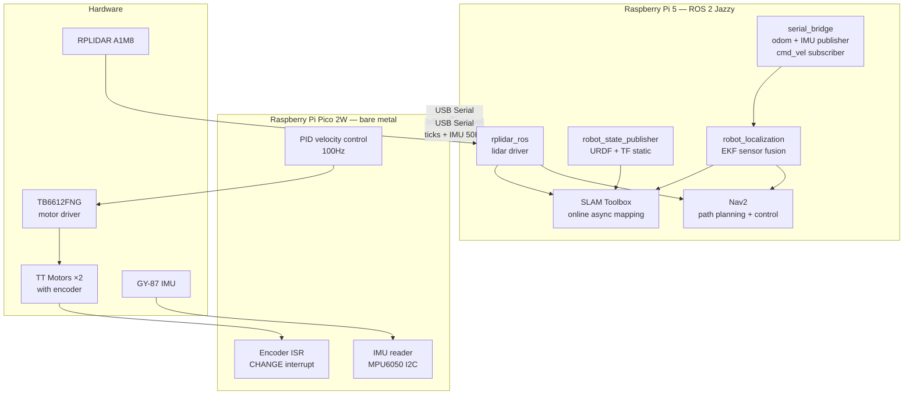
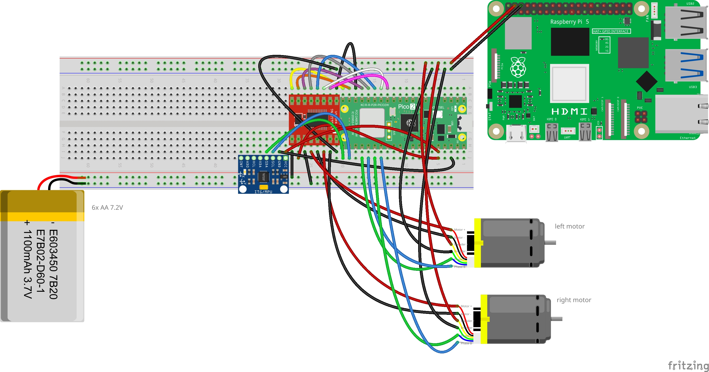
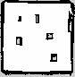
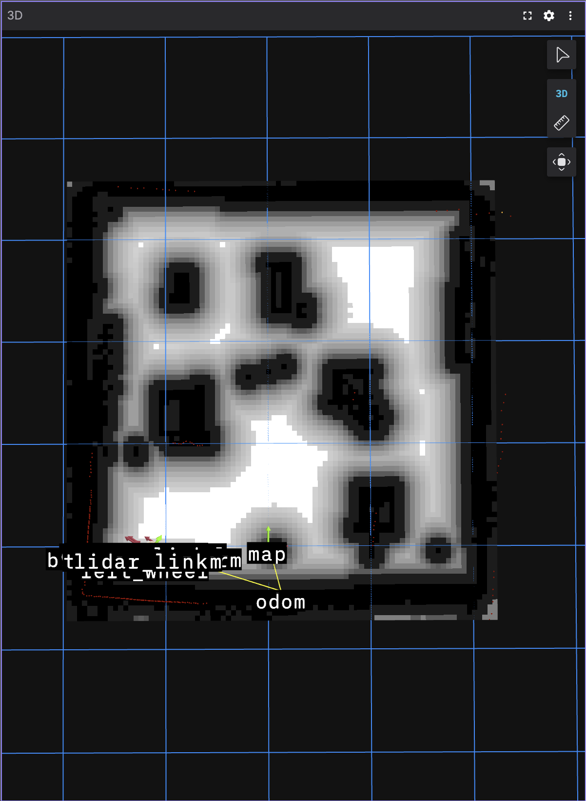

# PiBot — Open Source Autonomous Indoor Robot

> A fully autonomous indoor mobile robot built on Raspberry Pi 5, featuring SLAM-based mapping, Nav2 autonomous navigation, and a complete ROS 2 software stack. Built from scratch as a learning project and open sourced for the robotics community.

<!-- TODO:  -->

---

## Table of Contents

1. [Project Overview](#1-project-overview)
2. [Design Decisions](#2-design-decisions)
3. [Bill of Materials](#3-bill-of-materials)
4. [Chassis Design and Assembly](#4-chassis-design-and-assembly)
5. [Wiring and Electronics](#5-wiring-and-electronics)
6. [Ubuntu 24.04 Setup](#6-ubuntu-2404-setup)
7. [libcamera Build from Source](#7-libcamera-build-from-source)
8. [ROS 2 Jazzy Setup](#8-ros-2-jazzy-setup)
9. [PlatformIO and Pico Firmware](#9-platformio-and-pico-firmware)
10. [ROS 2 Workspace Setup](#10-ros-2-workspace-setup)
11. [Development Tools](#11-development-tools)
12. [Calibration](#12-calibration)
13. [Running the Robot](#13-running-the-robot)
14. [SLAM Mapping](#14-slam-mapping)
15. [Autonomous Navigation with Nav2](#15-autonomous-navigation-with-nav2)
16. [Troubleshooting](#16-troubleshooting)
17. [Known Issues and Lessons Learned](#17-known-issues-and-lessons-learned)
18. [Future Work](#18-future-work)
19. [Resources](#19-resources)

---

## 1. Project Overview

PiBot is a fully autonomous indoor mobile robot built from scratch using off-the-shelf components and open source software. The project covers the complete robotics stack:

- **Hardware:** Custom laser-cut plywood chassis, differential drive with encoder motors, RPLIDAR A1, GY-87 IMU
- **Firmware:** PID velocity control on Raspberry Pi Pico 2W
- **Middleware:** ROS 2 Jazzy on Raspberry Pi 5 running Ubuntu 24.04
- **Perception:** RPLIDAR A1M8 for 2D lidar scanning
- **Localization:** AMCL on a pre-built map
- **Mapping:** SLAM Toolbox for online async mapping
- **Navigation:** Nav2 with Regulated Pure Pursuit controller
- **Sensor Fusion:** robot_localization EKF fusing wheel odometry and IMU

The project started as a ball-following robot following the [Digikey ROS 2 Tutorial Series](https://www.youtube.com/watch?v=mjrxf8EFSb8&list=PLEBQazB0HUySWueUF2zNyrA8LSX3rDvE7) and evolved into the full autonomous navigation stack in `pibot_base`.

> **Note:** The Raspberry Pi Camera Module 3 and `camera_ros` driver are included in the repository for optional use (e.g. computer vision, object detection) but are **not required** for replicating the navigation robot. The core navigation stack uses only the RPLIDAR and IMU.

**Navigation accuracy:** ~±10cm position, ~±30° heading at goal.
**Power bank runtime:** ~1 hour on the Anker Prime 12,000mAh.
**Motor battery runtime:** Varies — NiMH batteries drain faster than expected under load. Keep spare batteries charged.

### Architecture Overview



### Serial Communication Protocol

```
Pi 5 → Pico:  "left_vel,right_vel\n"       (float m/s, sent on cmd_vel)
Pico → Pi 5:  "lt,rt,ax,ay,az,gx,gy,gz\n" (ticks + IMU, 50Hz)
```

---

## 2. Design Decisions

### 2.1 Raspberry Pi 5 as Main Computer

The Pi 5 has sufficient CPU performance to run ROS 2, SLAM Toolbox, and Nav2 simultaneously, native USB 3.0 for reliable RPLIDAR connection, Ubuntu 24.04 support with ROS 2 Jazzy, and wide community support.

**Tradeoff:** The Pi 5 requires more power than alternatives (~5A peak), requiring a dedicated power bank.

### 2.2 Raspberry Pi Pico 2W as Hardware Bridge

Chosen following the Digikey ROS 2 Tutorial Series recommendation:

- **Real-time control:** Linux on the Pi 5 has non-deterministic scheduling. PID at 100Hz requires precise timing — the Pico runs bare metal
- **GPIO protection:** All motor and encoder connections stay on the Pico, protecting the Pi 5
- **Separation of concerns:** Clean split between high-level navigation (Pi 5) and low-level control (Pico)
- **Price:** Very cheap — the 2W variant was chosen over standard Pico because the price difference is minimal and WiFi/Bluetooth may be useful for future projects

**Known annoyance:** When firmware crashes, you cannot simply reflash. You must unplug the USB cable, hold BOOTSEL, reinsert USB (Pico appears as `RPI-RP2` drive), then flash again. This is worth knowing before you start.

### 2.3 PlatformIO over Arduino IDE

- **Remote flashing:** Compile and flash from Pi 5 over SSH — no separate computer needed
- **VS Code integration:** Same editor used for all ROS 2 development
- **Reproducible builds:** Libraries declared in `platformio.ini`
- **CLI:** `pio run --target upload` from any terminal

### 2.4 Three-Platform Laser-Cut Chassis

Before designing, all component measurements were gathered from technical drawings, datasheets, and physical measurement with calipers. Components were then laid out in Affinity Designer (top and side view) at correct scale before cutting anything.

Three circular platforms with M3 Abstandsbolzen (hex standoffs) were chosen:
- **Bottom:** Motor support structure, ball caster mount, power bank
- **Middle:** Pi 5, breadboard, Pico, motor driver, IMU
- **Top:** Lidar, camera

**Why circular:** Optimal for Nav2 — equal turning radius in all directions, simplest costmap footprint.

**Why laser-cut plywood:** Fast to iterate, precise holes, cheap, widely available at makerspaces.

**Why standoffs over spacers:** Laser-cutting spacers from acrylic would be brittle under screw torque. M3 brass standoffs are rigid, reusable, and cheap.

**Motor layout:** An equilateral triangle was designed to position motors and ball caster with equal spacing — theoretically optimal for turning. In practice the wheels stick out slightly more than planned due to not fully accounting for wheel width during layout. No operational impact but worth planning carefully.

**Kerf note:** The laser cutter removes a small amount of material (kerf) at each cut — this was not accounted for in the design. Joints that were intended to be tight fits were slightly loose as a result. Wood glue was used to compensate and produced a very stable result.

### 2.5 Wood Glue for Support Structure

The T-shaped support structure connecting motors and ball caster to the bottom platform is assembled using wood glue in addition to screws. The glue compensates for kerf tolerances and significantly increases rigidity.

### 2.6 RPLIDAR A1 over Other Lidars

Cheapest available 360° lidar at Berrybase.de (~€90). Praised by the Digikey channel for price-to-performance. 12m range and 5-8Hz scan rate are adequate for slow indoor navigation.

### 2.7 Anker Prime Power Bank

The Anker Prime 12,000mAh 130W powers the Pi 5 and all connected electronics (cooling fan, lidar, encoders, Pico). Provides ~1 hour runtime. Minimum 5V/5A output is required for stable Pi 5 operation.

### 2.8 NiMH Batteries for Motors

6× AA NiMH 1.2V 2800mAh batteries power the motors. NiMH chosen over alkaline for rechargeability and consistent voltage under load. Runtime is shorter than expected under heavy use — keep spare sets charged.

### 2.9 camera_ros for Camera Integration (Optional)

The `camera_ros` package by Christian Rauch is included in the repository for optional Camera Module 3 integration. It handles the libcamera stack natively as a ROS 2 node, publishing standard `sensor_msgs/Image` topics. This is useful for future extensions like object detection or visual servoing, but is **not required** for the core navigation stack. If you don't plan to use a camera, you can skip the libcamera build (Section 7) and ignore the `camera_ros` submodule.

---

## 3. Bill of Materials

### Electronics (Berrybase.de)

| Component | Description | Qty | Unit Price | Total |
|-----------|-------------|-----|------------|-------|
| Raspberry Pi 5 | 8GB RAM, main compute | 1 | €127.90 | €127.90 |
| Raspberry Pi Pico 2W | RP2350 + WiFi + BT, with headers | 1 | €8.50 | €8.50 |
| _Raspberry Pi Camera Module 3 (optional)_ | 12MP, IMX708 sensor | 1 | €28.90 | €28.90 |
| Raspberry Pi Active Cooler | Fan for Pi 5 | 1 | €5.90 | €5.90 |
| _Raspberry Pi 27W USB-C PSU (optional)_ | For desktop use / initial setup | 1 | €12.40 | €12.40 |
| Seeed RPLIDAR A1M8 | 360° 2D laser scanner, 12m range | 1 | €89.90 | €89.90 |
| DFRobot TT Motor with Encoder | 160RPM, 120:1, quadrature encoder | 2 | €7.30 | €14.60 |
| SparkFun TB6612FNG | Dual motor driver with headers | 1 | €15.90 | €15.90 |
| GY-87 IMU | MPU-6050 + HMC5883L + BMP180 | 1 | €12.80 | €12.80 |
| Pololu Ball Caster | 0.75 inch metal ball, adjustable height | 1 | €4.50 | €4.50 |
| Wheels 65mm | Rubber tyre, 2 pieces | 1 set | €4.60 | €4.60 |
| Breadboard 830 contacts | Main wiring board | 1 | €1.90 | €1.90 |
| Jumper Wire Set | F-F / M-M / F-M, 20cm | 1 | €4.90 | €4.90 |
| Battery Holder 6× AA | With 150mm cable | 2 | €0.75 | €1.50 |
| **Electronics Total** | | | | **~€333** |

> Prices from Berrybase.de, early 2026.

### Additional Components

| Component | Description | Notes |
|-----------|-------------|-------|
| Anker Prime Power Bank | 12,000mAh, 130W, USB-C | Powers Pi 5 + all electronics. Minimum 5V/5A required |
| AA NiMH Batteries (6×) | 1.2V, 2800mAh per cell | Motor power. Keep spare sets charged |
| Slide switch (SPST) | Two-position slide switch | Battery power cutoff, mounted with M2.5 screws |
| 4mm birch plywood | ~30×30cm sheet | Laser cut chassis. Available at hardware stores |
| Wood glue | Standard PVA wood glue | For chassis support structure assembly |
| M2/M2.5/M3 assorted screw kit | 900-piece set | See note below |
| M3 × 30mm screws (extra) | Motor mounting | Not included in standard kits — source separately |
| M2.5 × 40mm hex standoffs | Platform spacing | 6x 40mm standoffs or 12x 20mm standoffs (screwed together) |

**Screw sizes used:**
- M2.5 × 8mm, 12mm, 20mm — Pi 5 mounting
- M2 × 6mm, 8mm, 10mm, 12mm — Camera Module 3 and small components
- M3 × 8mm, 12mm, 16mm, 20mm — General chassis mounting
- M3 × 30mm — Motor mounting (source separately from hardware store or makerspace)

**Estimated total cost: ~€380–420** including power bank, batteries, screws, plywood, and glue.

---

## 4. Chassis Design and Assembly

### 4.1 Design Process

All component measurements were gathered before designing:
- Technical drawings: Pi 5, Camera Module 3, Pico 2W datasheets
- Product descriptions: motors, lidar, ball caster
- Physical calipers: wheel diameter, motor body, connectors

Components were laid out in Affinity Designer in both top view and side view at correct scale before cutting. This step is essential — it reveals conflicts and tight fits before wasting material.

### 4.2 Platform Stack

```
Top platform    z=138.7mm   Lidar (on standoffs), camera (front)
      │
      │  40mm M3 standoffs (×3)
      │
Mid platform    z=94.7mm    Pi 5, breadboard, Pico, motor driver, IMU
      │
      │  40mm M3 standoffs (×3)
      │
Bot platform    z=50.7mm    Anker power bank
      │
T-support structure         Motors (horizontal bar) + ball caster (vertical bar)
      │
Ground          z=0mm       Wheels (rear) + ball caster (front)
```

### 4.3 Key Dimensions

| Measurement | Value |
|-------------|-------|
| Platform diameter | 210mm |
| Platform thickness | 4mm |
| Gap between platforms | 40mm |
| Wheel center x-offset | -55.3mm from center (rear) |
| Wheel center y-offset | ±86.5mm from center |
| Ball caster x-offset | +86.8mm from center (front) |
| Wheelbase physical | 173mm center-to-center |
| Wheelbase effective (calibrated) | 159mm |
| Lidar x-offset | +6.9mm (slightly forward) |
| Ground clearance | 27mm |
| Wheel radius | 32.5mm |

### 4.4 Laser Cutting

**Software:** Affinity Designer — export as DXF for laser cutter.

**Files in `cad/`:**
- `chassis.af` — source file
- `chassis.dxf` — laser cutter export

**Kerf:** The laser removes a small amount of material at each cut. This was not accounted for in the original design — joints designed to be tight fits were slightly loose as a result. **Compensate with wood glue** which produces a strong and stable result. Alternatively, offset your cut lines outward by your laser's kerf width (typically 0.1–0.2mm for plywood).

**Tips:**
- Use hairline stroke (0.001mm) for cut lines
- Cut test holes before the full platforms to verify motor shaft and standoff diameters
- Label each platform before removing from the cutter sheet

### 4.5 Support Structure Assembly

The T-shaped support structure that holds the motors and ball caster is assembled with:
1. **Screws** (M3 × 30mm for motors)
2. **Wood glue** at all plywood-to-plywood joints

Apply wood glue to mating surfaces, clamp or hold for 30 minutes, allow 24 hours full cure before loading. The combination of glue and screws produces a very rigid structure despite the loose kerf fits.

### 4.6 Full Assembly Order

1. Dry-fit all laser-cut parts to verify fit before gluing
2. Glue and screw T-support structure together — allow to cure
3. Mount motors to horizontal bar of T-support (M3 × 30mm screws)
4. Attach T-support to underside of bottom platform
5. Mount ball caster to front vertical bar of T-support
6. Install wheels on motor output shafts
7. Install M2.5 × 40mm standoffs between platforms (3 per gap)
8. Mount power bank to bottom platform
9. Mount Pi 5 to middle platform (M2.5 standoffs)
10. Peel off breadboard bottom and stick glued side to middle platform
11. Mount Pico, motor driver on breadboard
12. Mount IMU — note orientation for software correction
13. Mount lidar on standoffs on top platform
14. Mount camera at front of top platform
15. Route and connect all wiring (Section 5)
16. Mount slide switch accessibly on the top cutout

---

## 5. Wiring and Electronics



### 5.1 Power Architecture

Two separate power rails isolate motor noise from computer electronics:

```
AA NiMH Batteries (6×, ~7.2V)
    │
    ├── Slide switch
    └── TB6612FNG VM (motor power)

Anker Prime Power Bank (5V USB-C)
    │
    └── Raspberry Pi 5
        └── Pi 5 GPIO 5V pin → Encoder VCC

Common GND: Pi 5 GND + Pico GND + Battery − + TB6612FNG GND + Encoder GND + IMU GND
            all connected to breadboard GND rail
```

### 5.2 Pico GPIO Pin Assignments

| GPIO | Function |
|------|----------|
| 9 | PWMB — right motor PWM |
| 10 | BIN2 — right motor direction |
| 11 | BIN1 — right motor direction |
| 12 | STBY — motor driver standby |
| 13 | AIN1 — left motor direction |
| 14 | AIN2 — left motor direction |
| 15 | PWMA — left motor PWM |
| 16 | SDA — IMU I2C data (I2C0) |
| 17 | SCL — IMU I2C clock (I2C0) |
| 18 | ENC_LEFT_A |
| 19 | ENC_LEFT_B |
| 20 | ENC_RIGHT_A |
| 21 | ENC_RIGHT_B |

### 5.3 TB6612FNG Connections

| TB6612FNG Pin | Connected To |
|---------------|--------------|
| PWMA | Pico GPIO 15 |
| AIN1 | Pico GPIO 13 |
| AIN2 | Pico GPIO 14 |
| PWMB | Pico GPIO 9 |
| BIN1 | Pico GPIO 11 |
| BIN2 | Pico GPIO 10 |
| STBY | Pico GPIO 12 |
| VM | Battery + (~7.2V) |
| VCC | Pico 3.3V |
| GND | Common ground |
| A01, A02 | Left motor |
| B01, B02 | Right motor |

### 5.4 Encoder Connections

> ⚠️ **Voltage level warning:** The DFRobot TT encoders require 4.5–7.5V on VCC and output signals at that voltage. The Raspberry Pi Pico 2W GPIO pins are rated for 3.3V maximum. Connecting 5V signals directly to Pico GPIO pins is technically out of spec and may cause long-term damage.
>
> The correct solution is a **logic level converter** (bi-directional, 3.3V↔5V) on the A and B signal lines. These cost ~€1–2 on AliExpress and are the recommended approach.
>
> During development, direct 5V→Pico GPIO connection was used after voltage dividers caused severe pulse loss (>90% of encoder pulses were missed). Direct connection worked reliably for this project but proceed at your own risk. If you experience erratic encoder readings or Pico failures, a logic level converter is the proper fix.

| Encoder Pin | Connected To |
|-------------|--------------|
| VCC | Pi 5 5V (GPIO header pin 2 or 4) |
| GND | Common ground |
| A phase | Logic level converter → Pico GPIO (18=left, 20=right) |
| B phase | Logic level converter → Pico GPIO (19=left, 21=right) |

**Why Pi 5 5V and not Pico 5V:** The Pico does not have a 5V output pin. The Pi 5 GPIO header provides a stable 5V rail from the USB-C power supply.

### 5.5 GY-87 IMU Connections

Operates at 3.3V — directly compatible with Pico. GPIO 16/17 are I2C0 — use `Wire` (not `Wire1`) in firmware.

| GY-87 Pin | Connected To |
|-----------|--------------|
| VCC / 3.3V | Pico 3.3V |
| GND | Common ground |
| SDA | Pico GPIO 16 |
| SCL | Pico GPIO 17 |
| FSYNC, INTA, DRDY | Not connected |

I2C addresses: MPU-6050 = 0x68, HMC5883L = 0x1E, BMP180 = 0x77.

**Mounting:** The GY-87 is mounted backwards (Y axis points toward robot rear). This is corrected in software — see Section 10.6.

### 5.6 RPLIDAR Setup

Connects via USB to Pi 5. Create stable udev symlink:

```bash
sudo tee /etc/udev/rules.d/99-rplidar.rules << 'EOF'
KERNEL=="ttyUSB*", ATTRS{idVendor}=="10c4", ATTRS{idProduct}=="ea60", MODE="0666", GROUP="dialout", SYMLINK+="rplidar"
EOF
sudo udevadm control --reload-rules && sudo udevadm trigger
```

### 5.7 Slide Switch

Wire in series on battery positive line:
```
Battery + → Slide switch → TB6612FNG VM
Battery − → Common ground
```

Mount with M2.5 screws through chassis wall.

---

## 6. Ubuntu 24.04 Setup

### 6.1 Installation

Download Ubuntu 24.04 LTS for Raspberry Pi from: https://ubuntu.com/download/raspberry-pi

Flash to SD card using Raspberry Pi Imager. Ubuntu Server (headless) is recommended — smaller footprint, cooler operation. All development is done remotely over SSH.

### 6.2 Initial Configuration

```bash
sudo apt update && sudo apt upgrade -y

sudo apt install -y \
    git curl wget vim tmux \
    python3-pip python3-serial \
    net-tools usbutils

# Serial port access
sudo usermod -a -G dialout $USER
```

### 6.3 SSH Setup

```bash
# Enable passwordless SSH from your development machine
ssh-copy-id your-user@pibot.local

# Add to ~/.ssh/config on your Mac/PC
Host pibot
    HostName pibot.local
    User your-user
    ForwardX11 yes
```

### 6.4 VS Code Remote Development

Install the **Remote - SSH** extension in VS Code. Connect to the Pi 5 and open `~/pibot` as your workspace. All development — firmware, ROS 2 packages, configuration files — can be done remotely with full IDE features.

---

## 7. libcamera Build from Source

> **Optional:** This section is only needed if you want to use the Raspberry Pi Camera Module 3. The core navigation stack does not require a camera.

The Pi 5 with Camera Module 3 (IMX708 sensor) on Ubuntu 24.04 requires the Raspberry Pi fork of libcamera. The standard Ubuntu package does not support this sensor.

> This guide follows: https://dev.to/minindu_pasan_8f0e03c1063/how-to-setup-raspberry-pi-camera-module-3-on-ubuntu-2404-4pme

### 7.1 Install Build Dependencies

```bash
sudo apt install -y \
    meson ninja-build pkg-config \
    libgnutls28-dev openssl libtiff-dev \
    pybind11-dev qtbase5-dev libqt5core5a \
    libboost-dev libglib2.0-dev \
    libgstreamer-plugins-base1.0-dev \
    python3-yaml python3-ply python3-jinja2
```

### 7.2 Clone and Build

```bash
cd ~
git clone https://github.com/raspberrypi/libcamera.git
cd libcamera

meson setup build \
    -Dpipelines=rpi/pisp \
    -Dipas=rpi/pisp \
    -Dv4l2=true \
    -Dpycamera=enabled

ninja -C build
sudo ninja -C build install
```

### 7.3 Fix Python Bindings Path

```bash
echo "/usr/local/lib/python3/dist-packages" | \
    sudo tee /usr/local/lib/python3.12/dist-packages/libcamera.pth
```

### 7.4 Verify

```bash
cam -l   # should list: imx708 camera
python3 -c "import libcamera; print('OK')"
```

### 7.5 libcamera in the ROS 2 Workspace

The `camera_ros` package requires the libcamera source to be present in the workspace for building. This repository includes libcamera as a git submodule at `pibot_ws/src/libcamera`.

> **Note:** The libcamera submodule is configured with `shallow = true` in `.gitmodules` to avoid downloading the full repository history. This significantly reduces clone size.

If you cloned without submodules, initialize them manually:

```bash
cd ~/pibot
git submodule update --init --depth 1
```

The workspace build will compile libcamera alongside the ROS 2 packages using `colcon-meson`.

---

## 8. ROS 2 Jazzy Setup

### 8.1 Install ROS 2 Jazzy

```bash
sudo apt install -y software-properties-common
sudo add-apt-repository universe
sudo apt update && sudo apt install -y curl

sudo curl -sSL https://raw.githubusercontent.com/ros/rosdistro/master/ros.key \
    -o /usr/share/keyrings/ros-archive-keyring.gpg

echo "deb [arch=$(dpkg --print-architecture) signed-by=/usr/share/keyrings/ros-archive-keyring.gpg] \
    http://packages.ros.org/ros2/ubuntu $(. /etc/os-release && echo $UBUNTU_CODENAME) main" | \
    sudo tee /etc/apt/sources.list.d/ros2.list > /dev/null

sudo apt update
sudo apt install -y ros-jazzy-desktop
```

### 8.2 Environment Setup

```bash
echo "source /opt/ros/jazzy/setup.bash" >> ~/.bashrc
source ~/.bashrc
```

### 8.3 Install Required Packages

```bash
sudo apt install -y \
    ros-jazzy-robot-localization \
    ros-jazzy-slam-toolbox \
    ros-jazzy-navigation2 \
    ros-jazzy-nav2-bringup \
    ros-jazzy-rplidar-ros \
    ros-jazzy-robot-state-publisher \
    ros-jazzy-joint-state-publisher \
    ros-jazzy-tf2-ros \
    ros-jazzy-tf2-tools \
    ros-jazzy-cv-bridge \
    ros-jazzy-foxglove-bridge \
    ros-jazzy-teleop-twist-keyboard \
    ros-jazzy-nav2-map-server \
    python3-colcon-common-extensions \
    python3-colcon-meson \
    python3-rosdep

# Python serial library — required by serial_bridge node
sudo pip3 install pyserial --break-system-packages
```

### 8.4 Initialize rosdep

```bash
sudo rosdep init
rosdep update
```

### 8.5 udev Rules

```bash
# RPLIDAR stable symlink
sudo tee /etc/udev/rules.d/99-rplidar.rules << 'EOF'
KERNEL=="ttyUSB*", ATTRS{idVendor}=="10c4", ATTRS{idProduct}=="ea60", MODE="0666", GROUP="dialout", SYMLINK+="rplidar"
EOF

# Pico 2W upload permissions
sudo tee /etc/udev/rules.d/99-pico.rules << 'EOF'
SUBSYSTEMS=="usb", ATTRS{idVendor}=="2e8a", MODE="0666"
EOF

sudo udevadm control --reload-rules && sudo udevadm trigger
```

---

## 9. PlatformIO and Pico Firmware

### 9.1 Install PlatformIO

```bash
sudo pip3 install platformio --break-system-packages
```

### 9.2 Project Structure

```
pico_firmware/
├── platformio.ini
└── src/
    └── main.cpp
```

**platformio.ini:**
```ini
[env:rpipico2w]
platform = https://github.com/maxgerhardt/platform-raspberrypi.git
board = rpipico2w
framework = arduino
board_build.core = earlephilhower
upload_port = /dev/ttyACM0
monitor_port = /dev/ttyACM0
monitor_speed = 115200
lib_deps =
    https://github.com/sparkfun/SparkFun_TB6612FNG_Arduino_Library.git
    adafruit/Adafruit MPU6050@^2.2.6
    adafruit/Adafruit Unified Sensor@^1.1.14
```

### 9.3 Build and Flash

```bash
cd ~/pibot/pico_firmware

pio run                     # build only
pio run --target upload     # build and flash
pio device monitor          # open serial monitor
```

> **If upload fails:** Put Pico into bootloader mode manually — unplug USB, hold BOOTSEL button, replug USB. The Pico appears as `RPI-RP2` drive. Run `pio run --target upload` again.

### 9.4 Firmware Design

**PID in ticks-per-interval units:**

The key design choice is running PID in ticks-per-10ms-interval rather than m/s. This matches the DFRobot encoder sample code approach and gives small, intuitive gains:

```cpp
// Convert m/s target to ticks per 10ms interval
float target_ticks = target_vel * (10.0f / 1000.0f) / DIST_PER_TICK;
// At 0.15 m/s: ~15.7 ticks per interval
// Kp=1.5: 1 tick error → 1.5 PWM correction
```

**Robot constants:**
```cpp
const float WHEEL_DIAMETER_M = 0.065f;
const float TICKS_PER_REV    = 2140.0f;  // empirically calibrated
const float DIST_PER_TICK    = PI * WHEEL_DIAMETER_M / TICKS_PER_REV;
const float MAX_WHEEL_VEL    = (160.0f / 60.0f) * PI * WHEEL_DIAMETER_M;
```

**PID gains (tune for your motors):**
```cpp
float KP = 1.5f;
float KI = 0.8f;
float KD = 0.05f;
const float MAX_INTEGRAL = 50.0f;  // anti-windup clamp
```

**Debug mode:** `#define DEBUG 1` prints target ticks, actual ticks, and PWM to serial monitor — useful for tuning. Set to 0 for normal operation.

---

## 10. ROS 2 Workspace Setup

### 10.1 Cloning and Building

```bash
git clone --recurse-submodules git@github.com:BennytheBomb/pibot.git
cd pibot/pibot_ws

rosdep install -y --from-paths src --ignore-src \
    --rosdistro jazzy --skip-keys=libcamera

colcon build
source install/setup.bash

echo "source ~/pibot/pibot_ws/install/setup.bash" >> ~/.bashrc
```

> If you already cloned without `--recurse-submodules`, run `git submodule update --init --depth 1` before building.

### 10.2 Package Overview

| Package | Purpose |
|---------|---------|
| `pibot_base` | Main package: serial bridge, URDF, EKF, SLAM, Nav2, launch files |
| `camera_ros` | Camera Module 3 ROS 2 driver — optional (submodule) |
| `libcamera` | Raspberry Pi libcamera fork — optional (submodule, shallow clone) |

### 10.3 Key Topics

| Topic | Type | Description |
|-------|------|-------------|
| `/odom` | `nav_msgs/Odometry` | Raw wheel encoder odometry |
| `/imu/data_raw` | `sensor_msgs/Imu` | Raw IMU (corrected for mounting) |
| `/odometry/filtered` | `nav_msgs/Odometry` | EKF-fused odometry |
| `/scan` | `sensor_msgs/LaserScan` | RPLIDAR scan |
| `/map` | `nav_msgs/OccupancyGrid` | SLAM occupancy grid |
| `/cmd_vel` | `geometry_msgs/Twist` | Motor velocity commands |
| `/goal_pose` | `geometry_msgs/PoseStamped` | Nav2 navigation goal |
| `/amcl_pose` | `geometry_msgs/PoseStamped` | AMCL robot pose estimate |

### 10.4 TF Tree

```
map
 └── odom  (AMCL correction)
      └── base_link  (serial_bridge / EKF)
           ├── lidar_link   (rpy="0 0 π" — mounted backwards)
           ├── imu_link     (rpy="0 0 π" — mounted backwards)
           ├── camera_link
           ├── left_wheel   (continuous joint)
           ├── right_wheel  (continuous joint)
           ├── ball_caster
           ├── bottom_platform
           ├── mid_platform
           └── top_platform
```

### 10.5 URDF Link Positions

Relative to `base_link` (ground level, robot center). REP-103: x=forward, y=left, z=up.

| Link | x (m) | y (m) | z (m) | Notes |
|------|-------|-------|-------|-------|
| bottom_platform | 0.0 | 0.0 | 0.0507 | |
| mid_platform | 0.0 | 0.0 | 0.0947 | |
| top_platform | 0.0 | 0.0 | 0.1387 | |
| left_wheel | -0.0553 | +0.0865 | 0.0325 | |
| right_wheel | -0.0553 | -0.0865 | 0.0325 | |
| ball_caster | +0.0868 | 0.0 | 0.010325 | |
| lidar_link | +0.0069 | 0.0 | 0.16785 | rpy="0 0 3.14159" |
| camera_link | +0.100 | 0.0 | 0.1151 | |
| imu_link | +0.004 | -0.004 | 0.1136 | rpy="0 0 3.14159" |

### 10.6 IMU Frame Correction

GY-87 mounted backwards — applied in `serial_bridge.py`:

```python
# robot_x = -imu_y,  robot_y = -imu_x,  robot_z = imu_z
msg.linear_acceleration.x = -imu_ay
msg.linear_acceleration.y = -imu_ax
msg.linear_acceleration.z =  imu_az
msg.angular_velocity.x = -imu_gy
msg.angular_velocity.y = -imu_gx
msg.angular_velocity.z =  imu_gz
```

Verify: rotating left gives positive `angular_velocity.z`. Stationary: `linear_acceleration.z ≈ +9.81`.

### 10.7 EKF Configuration

Fuses `/odom` (x, y, yaw, vx, vyaw) with `/imu/data_raw` (vyaw/gz only). Accelerometer excluded — too noisy for ground robot position estimation.

```yaml
frequency: 50.0
two_d_mode: true    # ignore z, roll, pitch
world_frame: odom   # map frame correction added by Nav2 AMCL
```

---

## 11. Development Tools

### 11.1 tmux — Terminal Management

Running 7-8 ROS 2 nodes simultaneously over SSH requires good terminal management. Install and configure tmux:

```bash
# tmux is installed in Section 6.2 initial setup
echo "set -g mouse on" >> ~/.tmux.conf  # enable drag-to-resize and click-to-focus
tmux source ~/.tmux.conf
```

**Essential shortcuts:**
```
Ctrl+B "      split pane horizontally
Ctrl+B %      split pane vertically
Ctrl+B arrows navigate between panes
Ctrl+B z      zoom pane fullscreen (press again to unzoom)
Ctrl+B d      detach (session keeps running in background)

tmux new -s robot       create named session
tmux attach -t robot    reattach to session
tmux kill-session -t robot  kill all nodes and session
```

Drag pane borders to resize after enabling mouse support.

### 11.2 Foxglove Studio — Visualization

Runs in the browser or as a desktop app, connects over WiFi — no display needed on the Pi:

```bash
# On Pi 5
ros2 launch foxglove_bridge foxglove_bridge_launch.xml
```

Connect: Foxglove desktop app → Open Connection → **Foxglove WebSocket** → `ws://[pi-ip]:8765`

> Use the **desktop app** rather than browser — browsers may block non-secure WebSocket connections from HTTPS pages.

**Useful panels:**
- **3D** — map, scan, robot model, TF
- **Map** — occupancy grid view
- **Plot** — odometry x/y over time for debugging
- **Publish** — send goal poses to Nav2
- **Raw Messages** — inspect any topic

### 11.3 VS Code Extensions

- Remote - SSH
- ROS (ms-iot.vscode-ros)
- C/C++ (for firmware development)
- Python
- PlatformIO IDE

### 11.4 Useful ROS 2 Commands

```bash
ros2 topic list                            # all active topics
ros2 topic echo /odom                      # stream topic messages
ros2 topic hz /scan                        # check publish rate
ros2 node list                             # active nodes
ros2 node info /serial_bridge              # node connections
ros2 run tf2_tools view_frames             # generate TF tree PDF
ros2 run tf2_ros tf2_echo odom lidar_link  # check specific transform
ros2 lifecycle get /slam_toolbox           # SLAM Toolbox state
```

---

## 12. Calibration

These calibrations must be performed after assembly. Pre-calibrated values in the firmware and serial bridge are specific to the motors used in this build — your motors will likely differ.

> **Testing approach:** Because opening a new serial connection resets the Pico, use separate scripts for before/after readings rather than trying to send commands and read results in a single script.

### 12.1 Motor Direction

```bash
python3 -c "
import serial, time
s = serial.Serial('/dev/ttyACM0', 115200, timeout=2)
time.sleep(3)
s.write(b'0.1,0.1\n')
time.sleep(3)
s.write(b'0.0,0.0\n')
s.close()
"
```

Both wheels should spin forward. If a motor spins backward, swap its output wires on the TB6612FNG (A01↔A02 or B01↔B02).

### 12.2 Encoder Direction

Spin each wheel by hand and verify ticks change correctly:

```bash
python3 -c "
import serial, time
s = serial.Serial('/dev/ttyACM0', 115200, timeout=2)
time.sleep(3)
prev = None
for _ in range(60):
    line = s.readline().decode('utf-8', errors='ignore').strip()
    parts = line.split(',')
    if len(parts) == 8:
        lt, rt = int(parts[0]), int(parts[1])
        if prev != (lt, rt):
            print(f'L:{lt:>8} R:{rt:>8}')
            prev = (lt, rt)
s.close()
"
```

Spin forward → counts increase. Spin backward → counts decrease.

### 12.3 TICKS_PER_REV Calibration

**Step 1 — Read start ticks:**
```bash
python3 -c "
import serial, time
s = serial.Serial('/dev/ttyACM0', 115200, timeout=2)
time.sleep(3)
for _ in range(5): s.readline()
for _ in range(3):
    line = s.readline().decode('utf-8', errors='ignore').strip()
    parts = line.split(',')
    if len(parts) == 8: print(f'L:{parts[0]} R:{parts[1]}')
s.close()
"
```

**Step 2 — Drive forward and measure distance:**
```bash
python3 -c "
import serial, time
s = serial.Serial('/dev/ttyACM0', 115200, timeout=2)
time.sleep(3)
s.write(b'0.15,0.15\n')
time.sleep(4)
s.write(b'0.0,0.0\n')
s.close()
"
```

Mark start and end positions with tape. Measure actual distance.

**Step 3 — Read end ticks** (same script as Step 1).

**Calculate:**
```python
import math
delta = ((end_l - start_l) + (end_r - start_r)) / 2
actual_m = 0.335  # replace with your measurement
ticks_per_rev = delta / (actual_m / (math.pi * 0.065))
print(f"TICKS_PER_REV = {ticks_per_rev:.0f}")
```

**Why not 960:** `CHANGE` mode interrupts count both rising and falling edges of the A phase, doubling the nominal 960. Empirical calibration gave ~2140 for these specific motors. Always calibrate.

Update in **both** files:
- `pico_firmware/src/main.cpp`: `const float TICKS_PER_REV = XXXX.0f;`
- `pibot_ws/src/pibot_base/pibot_base/serial_bridge.py`: `TICKS_PER_REV = XXXX`

### 12.4 Wheelbase Calibration

Mark robot heading on the floor. Rotate approximately 360° in place. Measure actual angle.

```python
import math
DIST_PER_TICK = math.pi * 0.065 / 2140  # use your TICKS_PER_REV
dl = (end_l - start_l) * DIST_PER_TICK
dr = (end_r - start_r) * DIST_PER_TICK
arc = dr - dl
actual_rad = actual_degrees * math.pi / 180
wheelbase = arc / actual_rad
print(f"WHEELBASE_M = {wheelbase:.4f}")
```

Update `WHEELBASE_M` in `serial_bridge.py`. Effective wheelbase is typically less than physical due to wheel slip during turns — this is normal.

### 12.5 PID Tuning

Enable `#define DEBUG 1` in firmware. Observe target vs actual ticks in serial monitor while driving.

1. Set `KI=0, KD=0`. Increase `KP` until velocity tracks promptly without oscillation
2. Add `KI` to remove steady-state error
3. Add small `KD` only if oscillation appears

Starting values: `KP=1.5, KI=0.8, KD=0.05`

---

## 13. Running the Robot

### 13.1 Startup Sequence

```bash
# Terminal 1 — hardware bridge (must be first)
ros2 run pibot_base serial_bridge

# Terminal 2 — EKF sensor fusion
ros2 launch pibot_base ekf.launch.py

# Terminal 3 — robot model and static TF
ros2 launch pibot_base display.launch.py

# Terminal 4 — lidar
ros2 launch pibot_base lidar.launch.py

# Terminal 5 — visualization (recommended)
ros2 launch foxglove_bridge foxglove_bridge_launch.xml
```

### 13.2 Verify

```bash
ros2 topic hz /odom               # ~50 Hz
ros2 topic hz /odometry/filtered  # ~50 Hz
ros2 topic hz /scan               # ~6-7 Hz
ros2 run tf2_ros tf2_echo odom lidar_link  # prints transform immediately
```

### 13.3 Teleop Control

```bash
ros2 run teleop_twist_keyboard teleop_twist_keyboard
```

Press `z` several times to reduce speed to ~0.12 m/s.

**Recommended keys only:**
```
i    forward
,    backward
j    turn left
l    turn right
k    stop — always press before changing direction
```

Avoid diagonal keys (u, o, m, .) — they accumulate velocity in ways that cause unstable motor behavior.

---

## 14. SLAM Mapping

### 14.1 Prepare the Environment

- Clear floor of cables and small obstacles
- Add 2-3 asymmetric landmarks (cardboard boxes) — critical in square rooms where all walls look identical to the lidar
- Consistent lighting helps but is not required for lidar-only SLAM

### 14.2 Start SLAM

```bash
ros2 launch pibot_base slam.launch.py
```

SLAM Toolbox is a lifecycle node on ROS 2 Jazzy. After the node starts, activate it manually:

```bash
# Wait until this shows: unconfigured [1]
ros2 lifecycle get /slam_toolbox

ros2 lifecycle set /slam_toolbox configure
sleep 2
ros2 lifecycle set /slam_toolbox activate

# Verify
ros2 lifecycle get /slam_toolbox    # should show: active [3]
ros2 topic list | grep map          # should show /map
```

### 14.3 Mapping Strategy

Drive at maximum 0.12 m/s:

1. **Perimeter first** — drive along all walls in one continuous loop returning to start. This triggers loop closure and is the most important step
2. **Fill the middle** — S-pattern through the room center
3. **Second perimeter** — repeat for better loop closure quality

**Tips:**
- Gradual arcs rather than sharp in-place turns
- Brief stop at corners before turning
- Return close to start position to trigger loop closure
- Avoid long reverse movements

### 14.4 Monitor Quality in Foxglove

Add `/map` and `/scan` to the 3D panel. Lidar dots should align with black wall lines. If they float away, SLAM has lost tracking — restart.

```bash
ros2 topic hz /map   # ~0.2 Hz updates
```

### 14.5 Save the Map

```bash
ros2 run nav2_map_server map_saver_cli -f ~/map \
    --ros-args -p save_map_timeout:=10.0
```

Creates `~/map.pgm` and `~/map.yaml`.

### 14.6 Example Map

Saved occupancy grid after mapping a room with cardboard box landmarks:



---

## 15. Autonomous Navigation with Nav2

### 15.1 Start Nav2

```bash
# After serial_bridge, ekf, display, lidar are running:
ros2 launch pibot_base nav2.launch.py
```

Wait for:
```
[lifecycle_manager_navigation]: Managed nodes are active
```

Nav2 running in Foxglove with the SLAM map, robot model, and TF frames:



### 15.2 Initial Pose

AMCL assumes the robot starts at the map origin (x=0, y=0). Place the robot at the same position as when mapping started, facing the same direction.

### 15.3 Send Navigation Goals

**From Foxglove:** Add a Publish panel → topic `/goal_pose` → type `geometry_msgs/PoseStamped`:

```json
{
  "header": {"frame_id": "map"},
  "pose": {
    "position": {"x": 1.0, "y": 0.0, "z": 0.0},
    "orientation": {"x": 0.0, "y": 0.0, "z": 0.0, "w": 1.0}
  }
}
```

**From command line:**
```bash
ros2 action send_goal /navigate_to_pose nav2_msgs/action/NavigateToPose \
  "{pose: {header: {frame_id: 'map'}, pose: {position: {x: 1.0, y: 0.0, z: 0.0}, orientation: {w: 1.0}}}}"
```

### 15.4 Key Nav2 Parameters

`pibot_base/config/nav2_params.yaml`:

```yaml
robot_radius: 0.115          # half of 210mm platform diameter
inflation_radius: 0.45       # meters — keep robot away from obstacles
desired_linear_vel: 0.15     # m/s
rotate_to_heading_angular_vel: 0.3  # rad/s — keep low to avoid overshoot
xy_goal_tolerance: 0.3       # meters
yaw_goal_tolerance: 0.5      # radians
required_movement_radius: 0.1  # meters per progress check
movement_time_allowance: 15.0  # seconds
```

---

## 16. Troubleshooting

**SLAM not publishing /map**
SLAM Toolbox requires manual lifecycle activation on Jazzy. See Section 14.2.

**Robot drifts while driving straight**
Check encoder calibration (Section 12.2–12.3). Increase PID `KI` to correct steady-state velocity error.

**Encoder pulse loss**
If using voltage dividers on encoder signal lines, remove them. Use a proper logic level converter instead.

**libcamera Python import error**
```bash
echo "/usr/local/lib/python3/dist-packages" | \
    sudo tee /usr/local/lib/python3.12/dist-packages/libcamera.pth
```

**Nav2 bt_navigator fails to start**
Use behavior tree without recovery behaviors in `nav2_params.yaml`:
```yaml
navigate_to_pose:
  default_bt_xml_filename: "/opt/ros/jazzy/share/nav2_bt_navigator/behavior_trees/navigate_w_replanning_only_if_path_becomes_invalid.xml"
```

**Nav2 "Failed to make progress"**
Increase `movement_time_allowance` and decrease `required_movement_radius`.

**Pico cannot be flashed**
Hold BOOTSEL, unplug USB, replug USB. Pico appears as `RPI-RP2` drive. Run `pio run --target upload`.

**RPLIDAR port changes after reconnect**
The udev symlink `/dev/rplidar` handles this automatically. If it doesn't appear: `sudo udevadm trigger`.

---

## 17. Known Issues and Lessons Learned

### Encoder Signal Level Shifting
Voltage dividers (2× 10kΩ) caused >90% pulse loss at motor operating speeds. A proper logic level converter is the correct solution. Direct 5V→3.3V connection worked in practice but is out of spec for the Pico GPIO.

### TICKS_PER_REV Is Not 960
`CHANGE` mode interrupts double the nominal count. Empirical calibration is essential — do not use datasheet values directly.

### SLAM Toolbox Lifecycle Node on Jazzy
Requires manual configure+activate after launch. `use_lifecycle_manager: False` does not prevent this on Jazzy.

### Effective vs Physical Wheelbase
Calibrated effective wheelbase (159mm) is less than physical (173mm) due to wheel slip. Always calibrate empirically.

### Kerf in Laser-Cut Joints
Joints were slightly loose due to unaccounted kerf. Wood glue compensated effectively — the result was very stable. Plan for kerf in your DXF or compensate with glue.

### IMU Backwards Mounting
GY-87 mounted backwards due to space constraints. Requires axis correction in software and URDF.

### Square Room SLAM Challenges
Identical walls give SLAM little to work with for loop closure. Always add asymmetric landmarks in square rooms.

### Pico BOOTSEL Reset
Firmware crash requires manual BOOTSEL reset procedure. This cannot be avoided when developing firmware.

---

## 18. Future Work

- **Coverage path planning** — systematic room coverage with `nav2_coverage`
- **Trash/object detection** — YOLO-based detection of objects on the floor
- **Robot arm** — simple manipulator for object interaction
- **ArUco markers** — fiducial markers for reliable relocalization
- **Custom PCB** — replace breadboard with soldered PCB
- **Battery monitoring** — low battery detection and return-to-dock
- **Improved PID** — feedforward term for faster velocity tracking
- **3D mapping** — depth camera upgrade for full 3D environment

---

## 19. Resources

### Learning

| Resource | Link |
|----------|------|
| Digikey ROS 2 Tutorial Series | https://www.youtube.com/watch?v=mjrxf8EFSb8&list=PLEBQazB0HUySWueUF2zNyrA8LSX3rDvE7 |
| Camera Module 3 on Ubuntu 24.04 | https://dev.to/minindu_pasan_8f0e03c1063/how-to-setup-raspberry-pi-camera-module-3-on-ubuntu-2404-4pme |
| Nav2 Documentation | https://docs.nav2.org |
| SLAM Toolbox | https://github.com/SteveMacenski/slam_toolbox |
| robot_localization | https://docs.ros.org/en/jazzy/p/robot_localization/ |
| REP-103 coordinate conventions | https://www.ros.org/reps/rep-0103.html |

### Key Packages

| Package | Repository |
|---------|------------|
| camera_ros | https://github.com/christianrauch/camera_ros |
| rplidar_ros | https://github.com/Slamtec/rplidar_ros |
| slam_toolbox | https://github.com/SteveMacenski/slam_toolbox |
| robot_localization | https://github.com/cra-ros-pkg/robot_localization |
| navigation2 | https://github.com/ros-navigation/navigation2 |
| foxglove_bridge | https://github.com/foxglove/ros-foxglove-bridge |
| SparkFun TB6612FNG | https://github.com/sparkfun/SparkFun_TB6612FNG_Arduino_Library |
| Adafruit MPU6050 | https://github.com/adafruit/Adafruit_MPU6050 |
| libcamera RPi fork | https://github.com/raspberrypi/libcamera |

### Hardware References

| Component | Link |
|-----------|------|
| DFRobot TT Motor with Encoder | https://www.dfrobot.com/product-1457.html |
| SparkFun TB6612FNG | https://www.sparkfun.com/products/14450 |
| Raspberry Pi 5 | https://datasheets.raspberrypi.com/rpi5/raspberry-pi-5-product-brief.pdf |
| Raspberry Pi Pico 2W | https://datasheets.raspberrypi.com/picow/pico-2-w-datasheet.pdf |
| RPLIDAR A1M8 | https://www.slamtec.ai/wp-content/uploads/2023/11/LD108_SLAMTEC_rplidar_datasheet_A1M8_v3.0_en.pdf |

---

## Documents Still Needed

- [ ] `media/robot.jpg` — Hero shot of the assembled robot
- [ ] `media/robot_front.jpg` — Front view of assembled robot
- [ ] `media/robot_side.jpg` — Side view showing three platform layers
- [ ] `media/robot_top.jpg` — Top view showing lidar and camera
- [ ] `media/robot_wiring.jpg` — Close-up of breadboard wiring
- [ ] `media/slam_mapping.mp4` — Video: SLAM mapping with Foxglove showing map building in real time
- [ ] `media/autonomous_nav.mp4` — Video: robot navigating autonomously to goal points

